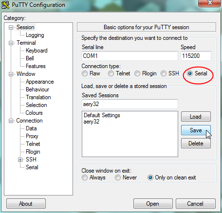
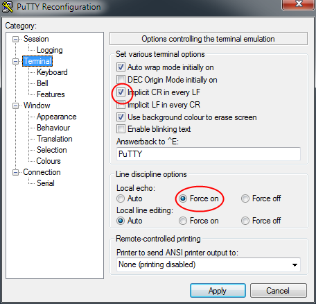

Serial Port class driver, `#include <aery32/serial_port_clsdrv.h> <https://github.com/aery32/aery32/blob/master/aery32/aery32/serial_port_clsdrv.h>`_
========================

Serial Port class driver implements serial port communication using :doc:`USART
module functions <../functions/usart>` and :doc:`Peripheral Input/Output DMA
class drivers <periph_iodma>`. The driver can be used to communicate
with PC via COM port and with other integrated chips (ICs) which provide
RX and TX signal pins. Hardware handshaking (the use of RTS and CTS signal
pins), which requires DMA to work, is also supported by the class. `Skip to
example <https://github.com/aery32/aery32/blob/master/examples/serial_port_class_driver.cpp>`_.

Class instantiation
-------------------

.. code-block:: c++

    serial_port(volatile avr32_usart_t *usart, aery::periph_idma &idma, aery::periph_odma &odma);

To instantiate a Serial Port class driver we need to tell its constructor
method which USART module we like to use. Additionally input and output
buffers, *idma* and *odma*, are needed. So let's allocate some space for
the needed buffers.

.. code-block:: c++

    volatile uint8_t bufdma0[128] = {};
    volatile uint8_t bufdma1[128] = {};

After then we can instantiate Peripheral DMA class drivers using the
buffers we just created.

.. code-block:: c++

    periph_idma dma0 = periph_idma(0, AVR32_PDCA_PID_USART0_RX, bufdma0, sizeof(bufdma0));
    periph_odma dma1 = periph_odma(1, AVR32_PDCA_PID_USART0_TX, bufdma1, sizeof(bufdma1));

The DMA pid value, which is the second parameter of the *periph_idma* and
*periph_odma* constructors, defines the USART data direction, so be sure to
select Peripheral DMA class' direction properly.

Now we are ready to instantiate the Serial Port class driver. Do not forgot
to enable it after instantiation.

.. code-block:: c++

    serial_port pc = serial_port(usart0, dma0, dma1);
    pc.enable();

.. note::

    The object name ``pc`` was used here, because the connection is intended
    to be use with PC. See the :ref:`setting-up-terminal` below.

Hello World!
------------

When the Serial Port class driver is instantiated and enabled it's ready
to be used. The well known "Hello World!" example would work like this

.. code-block:: c++

    pc << "Hello Aery" << 32;

or like this

.. code-block:: c++

    pc.printf("Hello Aery%d", 32);

A single character can be read like this

.. code-block:: c++

    char c = pc.getc();

If you like to put the character back to read buffer, use
``putback()`` member function.

Setting speed, parity and stop/data bits
----------------------------------------

.. code-block:: c++

    serial_port& set_speed(unsigned int speed);
    serial_port& set_parity(enum Usart_parity parity);
    serial_port& set_stopbits(enum Usart_stopbits stopbits);
    serial_port& set_databits(enum Usart_databits databits);

By default the speed is set to 115200 bit/s (error 0.16% with 66 MHz PBA
freq.). The default setting for parity is none. Stop and data bits are
1 and 8, respectively. All these settings can be changed with the upper class
member functions.

To change speed call ``pc.set_speed(speed);``. The baud error rate is
set to public ``error`` member and can be checked by calling ``pc.error``.

Parity and stop bits can be set like this

.. code-block:: c++

    pc.set_parity(USART_PARITY_NONE);
    pc.set_stopbits(USART_STOPBITS_1);

The possible parity options are ``USART_PARITY_EVEN``, ``USART_PARITY_ODD``,
``USART_PARITY_MARKED`` and ``USART_PARITY_SPACE``. The number of stop bits can be
``USART_STOPBITS_1``, ``USART_STOPBITS_1p5`` or ``USART_STOPBITS_2``.

The Serial Port class driver supports several data bits values from 5 to 9,
``USART_DATABITS_5`` etc. Generally 8 data bits is used, but if you need change
this it's possible to do with ``set_databits()`` member function. However,
keep in mind that if 9 data bits is used, you also have to change the size
of transfer of the used *periph_idma* and *periph_odma* class drivers
(9 bits do not fit in one byte, which is the default DMA transfer size)

Getline and line termination
----------------------------

.. code-block:: c++

    char* getline(char *str, size_t *nread, char delim);
    char* getline(char *str, size_t *nread, const char *delim);

The upper two member functions can be used to read the user input as lines.
This means that ``getline()`` will extract characters to *str* C string until
either the DMA input buffer is full or the delimiting character is found.
The delimitation character *delim* can be either a single character or two
sequential characters. *nread* is the total number of characters read
(delimitation character and ``\0`` aren't added to this value).

The following code would wait user input until the delimation character
``\n`` has been found.

.. code-block:: c++

    size_t nread = 0;
    char line[32] = "";

    pc.getline(line, &nread, '\n');

You can also omit the last two params (*nread* and *delim*). When *delim*
has been omitted the default setting ``\r\n`` is used. You can change this
by calling ``set_default_delim()`` member function as shown below.

.. code-block:: c++

    pc.set_default_delim('\n');
    pc.set_default_delim("\r\n");

.. note::

    Be specific with the ``''`` and ``""`` notation. For example,
    ``set_default_delim("\n");``     would set the default line
    termination to ``\n\0`` instead of ``\n``.

.. note::

    For input scanning, it's a good practice first fetch the line
    and then use ``sscanf()`` for that.

    .. code-block:: c++

        pc.getline(line);
        sscanf(line, "%d", &i);

.. hint::

    In main for loop you can skip empty lines this way

    .. code-block:: c++

        for (;;) {
            pc.getline(line, &nread);
            if (nread == 0) continue;

            // else do something
        }

Flush and other supportive functions
------------------------------------

.. code-block:: c++

    serial_port&    flush();
    size_t          bytes_available();

    serial_port&    reset();
    serial_port&    enable();
    serial_port&    disable();

    bool            is_enabled();

Sometimes you need to flush all bytes read into the input buffer. This
can be done with ``flush()`` member function. If you like to know
how many bytes have been received, call ``bytes_available()``. It's also
possible that the input buffer gets overflown, which can
be checked by calling ``has_overflown()``. If the buffer has been
overflown, you can reset the serial port by calling ``reset()``.

Hardware handshaking
--------------------

To enable hardware handshaking just call ``pc.enable_hw_handshaking();``.
When the handshaking is enabled the receiver drives the RTS pin and the level
on the CTS pin modifies the behavior of the transmitter.

.. _setting-up-terminal:

Setting up the terminal software in PC side
-------------------------------------------

There are several free terminal emulator software which to use in Windows.
`PuTTY <http://en.wikipedia.org/wiki/PuTTY>`_ and
`Tera Term <http://en.wikipedia.org/wiki/Tera_Term>`_ are most known and
widely used.

If you choose to use PuTTY, select serial and set up the port (serial line)
and speed. Before saving the session go to the Terminal slide and enable
*Implicit LF in every CR*. Additionally force the local echo to see what you
type. If you want to use Linux type line termination, select *Implicit CR in
every LF* and use **CTRL+J** to send lines instead of pressing **ENTER**.

