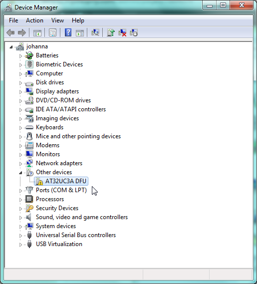
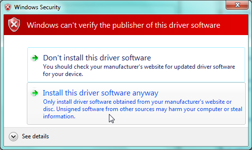

Getting Started
===============

Installation
----

Step 1: Install bunch of essential support software
''''

**In Windows**

Before connecting the board into your PC, download and install:

- The latest version of `FLIP in-system programmer <http://www.atmel.com/tools/FLIP.aspx>`_. This includes a software needed to upload new programs into Aery32 including the USB drivers that will be installed in step 2.
- `Atmel AVR Toolchain for Windows <http://www.atmel.com/tools/ATMELAVRTOOLCHAIN3_2_3FORWINDOWS.aspx>`_. This package includes C-libraries, GCC compiler for AVR microcontrollers and other essential development software that are needed to create programs for Aery32. Just run the installer. It doesn't matter if you have installed Atmel AVR Studio 5, which also has the toolchain built in. You can still install both of these and it is preferred to do so.

**In Linux**

Open terminal and command::

    su root

    # Install AVR32 Toolchain
    aptitude install curl flex bison libgmp3-dev libmpfr-dev autoconf build-essential libncurses5-dev libmpc-dev texinfo
    git clone git://github.com/muiku/avr32-toolchain.git
    cd avr32-toolchain
    PREFIX=/opt/avr32tools make install-cross

    # Install dfu in-system programmer
    aptitude install libusb-dev
    make install-dfu

    exit #leave root

Step 2: Install USB drivers
''''

**In Windows**

Connect the board to the computer by using USB cable. The LED on the board should turn on indicating that the preprogrammed program is running. To let your PC notice the presence of Aery32:

- Connect the slide switch on the board in to the opposite position.
- Press the reset button next to the slide switch.

Now Aery32 has been started into a bootloader and your computer should spot a new device connected to it. However, most likely your PC cannot find the drivers from FLIP installation by itself, so you have to see a little bit extra effort to complete the driver installation:

- Go to the Device Manager (Control Panel » Hardware and Sound » Device Manager).
- Find AT32UC3A DFU from the list.
- Right click to select Update Driver Software...
- Select the second option which says Browse my computer for driver software
- Browse to the Flip installation directory and make sure that subfolders are included too
- Press Next and when prompted press Install this driver software anyway

Step 3: Download Aery32 Software Framework
''''

todo

Basics of embedded software
---------------------------

.. code-block:: c
    :linenos:

    #include <stdbool.h>
    #include <aery32/gpio.h>
    #include "board.h"

    #define LED AVR32_PIN_PC04

    int main(void)
    {
        init_board();
        aery_gpio_init_pin(LED, GPIO_OUTPUT|GPIO_HIGH);

        for(;;) {
            /* Put your application code here */

        }

        return 0;
    }

Above you can see a basic embedded software coded by C programming language for Aery32. This piece of source code can be found from the ``src/main.c``. The ``main()`` function at line 7 is the first function to execute when the program starts -- thus it is called as the main function. The void keyword inside the brackets of the main function tells that it does not take any arguments. The main function hardly ever takes arguments in embedded software, so this is a very common situation.

The int keyword, before the main function, indicates that it will return integer type variable. Again, in the real life embedded software it is very common that there is no use for this piece of information. The return type has been specified here to be integer type, instead of making it void, only to keep the compiler happy. Otherwise the compiler would give a warning, which we do not want to see. For the sake of consistency the return value has been set zero at line 17, but the running application should never reach that far, or if it does, some serious error has occurred. Altough there is no use for the input arguments and the return value of the main, the embeded software code can, and most probably will, include other functions and those functions, of course, may have arguments and can return values which are relevant.

**Where to put the application code?**

If the program should never reach the line 17, you might guess where the code of actual application is placed. Correct! – It is placed inside of the infinite ``for(;;)`` loop. This loop goes on and on accomplish the code inside of it until the power is switched off. In this particular software there is only a comment line inside of the loop, so pretty much nothing is happening. What happens has been done at lines 9 and 10. These functions will be executed only once, because those do not fall into infinite for-loop. Furthermore, both of the function calls in those lines comes with the Aery32 Software Framework. The first one initializes the board, which is pretty much about starting the 12 MHz crystal oscillator and then setting up the main clock to 66 MHz. The second function call initializes a general purpose pin named ``LED`` that is the pin ``PC04`` to be exact as defined at line 5. The ``GPIO_OUTPUT|GPIO_HIGH`` part of the line states that the ``LED`` pin will be an output and initialized as high, meaning that a voltage of 3.3 V will appear on that pin. This turns the LED on, so in conclusion the job of this software is only to keep the LED burning.
