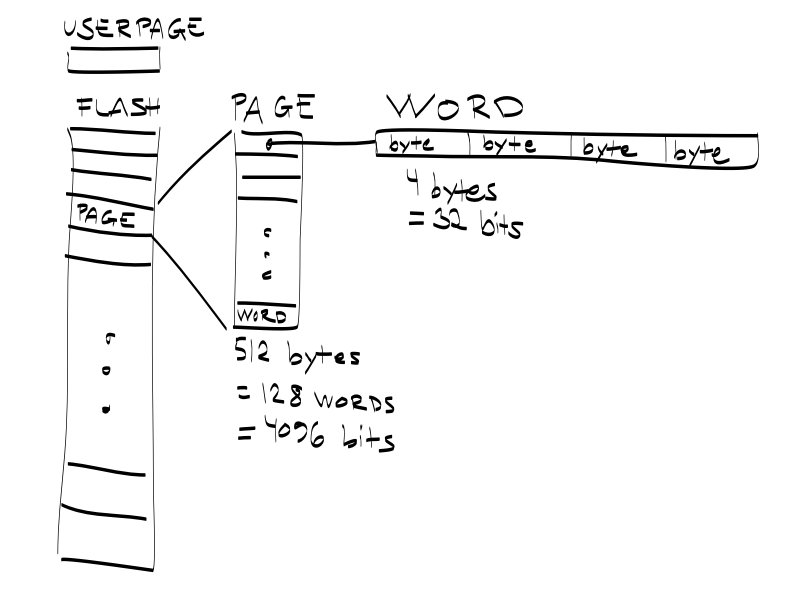

Module functions
================

**Modules are library components that operate with the MCU's internal peripherals.** Every module has its own namespace according to the module name. For example, Power Manager has module namespace of ``pm_``, Realtime Counter falls under the ``rtc_`` namespace, etc. To use the module just include its header file. These header files are also named after the module name. So, for example, to include and use functions that operate with the Power Manager include ``<aery32/pm.h>``.

Naming convention and the calling order
---------------------------------------

The common calling order for modules is the following: 1) initialize, 2) do some extra setuping and after then 3) enable the module. In pseudo code it looks like this

.. code-block:: c++

    module_init();
    module_setup_something();
    module_enable();

The init function may also look like ``module_init_something()``, for example, the SPI can be initialized as a master or slave, so the naming convention declares two init functions for SPI module: ``spi_init_master()`` and ``spi_init_slave()``.

If the module has been disabled, by using ``module_disable()`` function, it can be re-enabled without calling the init or setup functions. Most of the modules can also be reinitialized without disabling it before. For example, general clock frequencies can be changed by just calling the init function again -- this is also the quickest way to change the frequency

.. code-block:: c++

    pm_init_gclk(GCLK0, GCLK_SOURCE_PLL1, 1);
    pm_enable_gclk(GCLK0);

    /* Change the frequency divider */
    pm_init_gclk(GCLK0, GCLK_SOURCE_PLL1, 6);

If you have read through the MCU datasheet, you may wonder why you cannot set all the possible settings with the initialization and setup functions. This is because these functions set sane default values for those properties. These default values should work for 80-90% of use cases. However, sometimes you may have to fine tune these properties to match your needs. This can be done by bitbanging the module registers after you have called the init or setup function. For example, the SPI chip select baudrate is hard coded to `MCK/255` within the ``spi_setup_npcs()`` function. To make SPI bus faster you can bitbang the `SCRB bit` within `CSRn register`, where `n` is the NPCS number.

.. code-block:: c++

    spi_setup_npcs(spi0, 0, SPI_MODE1, 16);
    spi0->CSR0.scbr = 32; /* SPI baudrate for the CS0 is now MCK/32 */

.. note::

    Modules never take care of pin initialization, except GPIO module that's for this specific purpose. So, for example, when initializing SPI you have to take care of pin configuration!

    .. code-block:: c++

        #define SPI0_GPIO_MASK ((1 << 10) | (1 << 11) | (1 << 12) | (1 << 13))
        gpio_init_pins(porta, SPI0_GPIO_MASK, GPIO_FUNCTION_A);

Global variables and error handling
-----------------------------------

Every module declares global shortcut variables to the main registers of the module. For example, the GPIO module declares ``porta``, ``b`` and ``c`` global pointers to the MCU ports by default. Otherwise, you should have been more verbose and use ``&AVR32_GPIO.port[0]``, ``&AVR32_GPIO.port[1]`` and ``&AVR32_GPIO.port[2]``, respectively. Similarly, ``pll0`` and ``pll1`` declared in PM module provide quick access to MCU PLL registers etc.

.. hint::

    As ``porta``, ``b`` and ``c`` are pointers to the GPIO port, you can access its registers with arrow operator, for example, instead of using function ``gpio_toggle_pin(AVR32_PIN_PC04)`` you could have written ``portc->ovrt = (1 << 4);`` This is also way how you can set/unset/read/toggle multiple pins at once. Refer to the UC3A0/1 datasheet pages 175--177 for GPIO Register Map.

Error handling
''''''''''''''

All module functions will return -1 on general error. This will happen most probably because of invalid parameter values. Greater nagative return values have a specific meaning and a macro definition in the module's header file. For example, ``flashc_save_page()`` of Flash Controller may return -2 and -3, which have been defined with ``E`` prefixed names ``EFLASH_PAGE_LOCKED`` and ``EFLASH_PROG_ERR``, respectively.

Analog-to-digital conversion, ``#include <aery32/adc.h>``
---------------------------------------------------------

UC3A0/1 microcontrollers have eight 10-bit analog-to-digital converters. The maximum ADC clock frequency for the 10-bit precision is 5 MHz. For 8-bit precision it is 8 MHz. This frequency is related to the frequency of the Peripheral Bus A (PBA). When initialized a correct prescaler value has to be used. ``adc_init()`` will check this for you. -1 will be returned, if the clock requirement was not fullfilled.

.. code-block:: c++

    int errno;
    errno = adc_init(
        7,    /* prescal, adclk = pba_clk / (2 * (prescal+1)) */
        true, /* hires, 10-bit (false would be 8-bit) */
        0,    /* shtim, sample and hold time = (shtim + 1) / adclk */
        0     /* startup, startup time = (startup + 1) * 8 / adclk */
    );

The initialization statement given above, uses the prescaler value 7, so if the PBA clock was 66 MHz, the ADC clock would be 4.125 MHz. After initialization, you have to enable the channels that you like to use for the conversion. This can be done through the masking, so there is use for the good old ``<<`` bitwise shift operator.

.. code-block:: c++

    if (errno != -1)
        adc_enable(1 << 3); /* enables the channel 3 */

Now you can start the conversion. Be sure to wait that the conversion is ready before reading the conversion value.

.. code-block:: c++

    uint16_t result;

    adc_start_cnv();
    while (adc_isbusy(1 << 3));
    result = adc_read_cnv(3);

If you only want to read the latest conversion, whatever was the channel, you can omit the channel mask for busy function and read the conversion with another function like this

.. code-block:: c++

    while (adc_isbusy());
    result = adc_read_lastcnv();

To setup the ADC hardware trigger, call ``adc_setup_trigger()`` after init

.. code-block:: c++

    adc_setup_trigger(EXTERNAL_TRG);

Other possible trigger sources, that can be used for example with the Timer/Counter module, are

.. hlist::
    :columns: 3

    - ``INTERNAL_TRG0``
    - ``INTERNAL_TRG1``
    - ``INTERNAL_TRG3``
    - ``INTERNAL_TRG4``
    - ``INTERNAL_TRG5``

.. note::

    You always have to call ``adc_start_cnv()`` individually for every started conversion. If you suspect that your conversions may have overrun, you can check this with the ``adc_hasoverrun(chamask)`` function. If you omit the channel mask input param, all the channels will be checked, being essentially the same than calling ``adc_hasoverrun(0xff)``.

Flash Controller, ``#include <aery32/flashc.h>``
------------------------------------------------

Flash Controller provides low-level access to the chip's internal flash memory, whose structure has been sketched in the figure above. The init function of the Flash Controller sets the flash wait state and the state of the sense amplifiers. 

.. code-block:: c++

    flashc_init(FLASH_1WS, true);

.. warning::

    Setting up the correct flash wait state is extremely important! If CPU clock speed is higher than 33 MHz you have to use one wait state for flash. Otherwise you can use zero wait state, ``FLASH_0WS``. Note that this has to be set correctly even if the flash read and write operations, described below, are not used.

Read and write operations
'''''''''''''''''''''''''

Flash memory is accessed via pages that are 512 bytes long, and only 512 bytes. This means that you have to make sure that your page buffer is large enough to read and write pages, like this

.. code-block:: c++

    #include <cstring>

    char buf[512];
    flashc_read_page(FLASH_LAST_PAGE, buf); /* Read the last page to separate page buffer */
    strcpy(buf, "foo");                     /* Save string "foo" to page buffer */
    flashc_save_page(FLASH_LAST_PAGE, buf); /* Write page buffer back to flash */

You can also read and write values with different types as long as the page buffer size is that 512 bytes--Yes, 512 bytes per page.

.. code-block:: c++

    extern "C" #include <inttypes.h>

    uint16_t buf16[256];
    uint32_t buf32[128];

After saving the page it can be locked to prevent write or erase sequences.

.. code-block:: c++

    flashc_lock_page(0); /* Locks the first page, number 0 */

Locking is performed on a per-region basis, so the above statement does not lock only page zero, but all pages within the region (16 pages per region). To unlock the page call

.. code-block:: c++

    flashc_unlock_page(0);

There are also functions that takes the region as an input param, ``flashc_lock_preg()`` and ``flashc_unlock_preg()``. Furthermore, there is a function to check if the page is empty

.. code-block:: c++

    flashc_isempty(0);

.. warning::

    The uploaded program is also stored into the flash, so it is possible to overwrite it by using the Flash controller. The best practice for flash programming, is starting from the top. ``FLASH_LAST_PAGE`` macro definition gives the number of the last page in the flash. For 128 KB flash this would be 255.

General Periheral Input/Output, ``#include <aery32/gpio.h>``
------------------------------------------------------------

To initialize any pin to be output high, there is a oneliner which can be used

.. code-block:: c++

    gpio_init_pin(AVR32_PIN_PC04, GPIO_OUTPUT|GPIO_HIGH);

The first argument is the GPIO pin number and the second one is for options. For 100 pin Atmel AVR32UC3, the GPIO pin number is a decimal number from 0 to 69. Fortunately, you do not have to remember which number represent what port and pin. Instead you can use predefined aliases as it was done above with the pin PC04 (5th pin in port C if the PC00 is the 1st).

The available pin init options are:

.. hlist::
    :columns: 3

    - ``GPIO_OUTPUT``
    - ``GPIO_INPUT``
    - ``GPIO_HIGH``
    - ``GPIO_LOW``
    - ``GPIO_FUNCTION_A``
    - ``GPIO_FUNCTION_B``
    - ``GPIO_FUNCTION_C``
    - ``GPIO_FUNCTION_D``
    - ``GPIO_INT_PIN_CHANGE``
    - ``GPIO_INT_RAISING_EDGE``
    - ``GPIO_INT_FALLING_EDGE``
    - ``GPIO_PULLUP``
    - ``GPIO_OPENDRAIN``
    - ``GPIO_GLITCH_FILTER``
    - ``GPIO_HIZ``

These options can be combined with the pipe operator (boolean OR) to carry out several commands at once. Without this feature the above oneliner should be written with two lines of code:

.. code-block:: c++

        gpio_init_pin(AVR32_PIN_PC04, GPIO_OUTPUT);
        gpio_set_pin_high(AVR32_PIN_PC04);

Well now you also know how to set pin high, so you may guess that the following function sets it low

.. code-block:: c++

    gpio_set_pin_low(AVR32_PIN_PC04);

and that the following toggles it

.. code-block:: c++

    gpio_toggle_pin(AVR32_PIN_PC04);

and finally it should not be surprise that there is a read function too

.. code-block:: c++

    state = gpio_read_pin(AVR32_PIN_PC04);

But before going any further, let's quickly go through those pin init options. ``FUNCTION_A``, ``B``, ``C`` and ``D`` assing the pin to the specific peripheral function, see datasheet pages 45--48. ``INT_PIN_CHANGE``, ``RAISING_EDGE`` and ``FALLING_EDGE`` enables interrupt events on the pin. Interrupts are trigged on pin change, at the rising edge or at falling edge, respectively. ``GPIO_PULLUP`` connects pin to the internal pull up resistor. ``GPIO_OPENDRAIN`` in turn makes the pin operate as an open drain mode. This mode is gererally used with pull up resistors to guarantee a high level on line when no driver is active. Lastly ``GPIO_GLITCH_FILTER`` activates the glitch filter and ``GPIO_HIZ`` makes the pin high impedance.

Usually you want to init several pins at once -- not only one pin. This can be done for the pins that have the same port.

.. code-block:: c++

    gpio_init_pins(porta, 0xffffffff, GPIO_INPUT); /* initializes all pins input */

The first argument is a pointer to the port register and the second one is the pin mask.

.. note::

    Most of the combinations of GPIO init pin options do not make sense and have unknown consecuences.

Local GPIO bus
''''''''''''''

AVR32 includes so called local bus interface that connects its CPU to device-specific high-speed systems, such as floating-point units and fast GPIO ports. To enable local bus call

.. code-block:: c++

    gpio_enable_localbus();

When enabled you have to operate with `local` GPIO registers. That is because, the convenience functions described above does not work local bus. To ease operating with local bus Aery32 GPIO module provides shortcuts to local ports by declaring ``lporta``, ``b`` and ``c`` global pointers. Use these to read and write local port registers. For example, to toggle pin through local bus you can write

.. code-block:: c++

    lporta->ovrt = (1 << 4);

.. note::

    CPU clock has to match with PBB clock to make local bus functional

To disable local bus and go back to normal operation call

.. code-block:: c++

    gpio_disable_localbus();

Interrupt Controller, ``#include <aery32/intc.h>``
--------------------------------------------------

Before enabling interrupts define and register your interrupt service routine (ISR) functions. First write ISR function as you would do for any other functions

.. code-block:: c++

    void myisr_for_group1(void) {
        /* do something */
    }

Then register this function

.. code-block:: c++

    intc_register_isrhandler(&myisr_for_group1, 1, 0);

Here the first parameter is a function pointer to your ``myisr_for_group1()`` function. The second parameter defines the which interrupt group calls this function and the last one tells the priority level.

.. hint::

    Refer Table 12-3 (Interrupt Request Signal Map) in datasheet page 41 to see what peripheral belongs to which group. For example, RTC belongs to group 1.

When all the ISR functions have been declared it is time to initialize interrupts. Use the following init function to do all the magic

.. code-block:: c++

    intc_init();

After initialization you can enable and disable interrupts globally by using these functions

.. code-block:: c++

    intc_enable_globally();

.. code-block:: c++

    intc_disable_globally();

Power Manager, ``#include <aery32/pm.h>``
-----------------------------------------

Power Manager controls integrated oscillators and PLLs among other power related things. By default the MCU runs on the internal RC oscillator (115 kHz). However, it's often preferred to switch to the higher CPU clock frequency, so one of the first things what to do after the power up, is the initialization of oscillators. Aery32 Development Board has 12 MHz crystal oscillator connected to the OSC0. This can be started as

.. code-block:: c++

    pm_start_osc(
        0,               /* oscillator number */
        OSC_MODE_GAIN3,  /* oscillator mode, see datasheet p.74 */
        OSC_STARTUP_36ms /* oscillator startup time */
    );
    pm_wait_osc_to_stabilize(0);

When the oscillator has been stabilized it can be used for the master/main clock

.. code-block:: c++

    pm_select_mck(MCK_SOURCE_OSC0);

Now the CPU runs at 12 MHz frequency. The other possible source selections for the master clock are:

- ``MCK_SOURCE_OSC0``
- ``MCK_SOURCE_PLL0``
- ``MCK_SOURCE_PLL1``

Use PLLs to achieve higher clock frequencies
''''''''''''''''''''''''''''''''''''''''''''

Aery32 devboard can run at 66 MHz its fastest. To achieve these higher clock frequencies one must use PLLs. PLL has a voltage controlled oscillator (VCO) that has to be initialized first. After then the PLL itself can be enabled.

.. important::

    PLL VCO frequency has to fall between 80--180 MHz or 160--240 MHz with high frequency disabled or enabled, respectively. From these rules, one can realize that the smallest available PLL frequency is 40 MHz (the VCO frequency can be divided by two afterwards).

.. code-block:: c++

    pm_init_pllvco(
        pll0,            /* pointer to pll address */
        PLL_SOURCE_OSC0, /* source clock */
        11,              /* multiplier */
        1,               /* divider */
        false            /* high frequency */
    );

- If ``div > 0`` then ``f_vco = f_src * mul / div``
- If ``div = 0`` then ``f_vco = 2 * mul * f_src``

The above initialization sets PLL VCO frequency of PLL0 to 132 MHz -- that's ``12 MHz * 11 / 1 = 132 MHz``. After then PLL can be enabled and the VCO frequency appears on the PLL output. Remember that you can now also divide VCO frequency by two.

.. code-block:: c++

    pm_enable_pll(pll0, true  /* divide by two */); /* 132 MHz / 2 = 66 MHz */
    pm_wait_pll_to_lock(pll0);

Finally one can change the master clock (or main clock) to be clocked from the PLL0 that's 66 MHz.

.. code-block:: c++

    pm_select_mck(MCK_SOURCE_PLL0);

Fine tune the CPU and Periheral BUS frequencies
'''''''''''''''''''''''''''''''''''''''''''''''

By default the clock domains, that are CPU and the Peripheral Busses (PBA and PBB) equal to the master clock. To fine tune these clock domains, the PM has a 3-bit prescaler, which can be used to divide the master clock, before it has been used for the specific domain. Using the prescaler you can choose the CPU clock between the OSC0 frequency and 40 MHz, that was the lower limit of the PLL. Assuming that the master clock was 66 MHz, the following function call changes the CPU and the bus frequencies to 33 MHz:

.. code-block:: c++

    pm_setup_clkdomain(1, CLKDOMAIN_ALL);

The first parameter defines the prescaler value and the second one selects the clock domain which to set up. Here all the domains are set to equal. The formula is ``f_mck / (2^prescaler)``. With the prescaler selection 0, the prescaler block will be disabled and the selected clock domain equals to the master clock that was the default setting.

The possible clock domain selections are

.. hlist::
    :columns: 2

    - ``CLKDOMAIN_CPU``
    - ``CLKDOMAIN_PBA``
    - ``CLKDOMAIN_PBB``
    - ``CLKDOMAIN_ALL``

.. important::

    PBA and PBB clocks have to be less or equal to CPU clock. Morever, the flash wait state has to been taken into account at this point. If the CPU clock is over 33 MHz, the Flash controller has to be initialized with one wait state, like this ``flashc_init(FLASH_1WS, true)``. If the CPU clock speed is less or equal than 33 MHz, zero wait state is the correct setting for the flash.

.. hint::

    You can combine the clock domain selections with the pipe operator, like this ``CLKDOMAIN_CPU|CLKDOMAIN_PBB``. With this selection the PBA clock frequency won't be changed, but the CPU and PBB will be set up accordingly.

General clocks
''''''''''''''

PM can generate dedicated general clocks. These clocks can be assigned to GPIO pins or used for internal peripherals such as USB that needs 48 MHz clock to work. To offer this 48 MHz for the USB peripheral, you have to initialize either of the PLLs to work at 96 MHz frequency. As the PLL0 is commonly used for the master clock, PLL1 has been dedicated for general clocks. First initialize the VCO frequency and then enable the PLL

.. code-block:: c++

    pm_init_pllvco(pll1, PLL_SOURCE_OSC0, 16, 1, true); /* f_pll1_vco = 192 MHz */
    pm_enable_pll(pll1, true); /* f_pll1 = 96 MHz */
    pm_wait_pll_to_lock(pll1);

After then init and enable the USB generic clock

.. code-block:: c++

    pm_init_gclk(
        GCLK_USBB,        /* generic clock number */
        GCLK_SOURCE_PLL1, /* clock source for the generic clock */
        1                 /* divider */
    );
    pm_enable_gclk(GCLK_USBB);

- If ``div > 0`` then ``f_gclk = f_src/(2*div)``
- If ``div = 0`` then ``f_gclk = f_src``

There are five possible general clocks to be initialized:

.. hlist::
    :columns: 2

    - ``GCLK0``
    - ``GCLK1``
    - ``GCLK2``
    - ``GCLK3``
    - ``GCLK_USBB``
    - ``GCLK_ABDAC``

``GCLK_ABDAC`` is for Audio Bitstream DAC, ``GCLK0``, ``GCLK1``, etc. can be attached to GPIO pin, so that you can easily clock external devices. For example, to set generic clock to be at the output of GPIO pin, first init the desired GPIO pin appropriately and then enable the generic clock at this pin. You can do this, for example, to check that USB clock enabled above is correct

.. code-block:: c++

    gpio_init_pin(AVR32_PIN_PB19, GPIO_FUNCTION_B);
    pm_init_gclk(GCLK0, GCLK_SOURCE_PLL1, 1);
    pm_enable_gclk(GCLK0);

.. hint::

    Generic clock can be changed when its running by just initializing it again. You do not have to disable it before doing this and you do not have to enable it again.

Save power and use only the peripherals that you need
'''''''''''''''''''''''''''''''''''''''''''''''''''''

By default all modules are enabled. You might be interested in to disable modules you are not using. This can done via the peripheral clock masking. The following example disables clocks from the TWI, PWM, SSC, TC, ABDAC and all the USART modules

.. code-block:: c++

    #define PBAMASK_DEFAULT 0x0F
    pm->pbamask = PBAMASK_DEFAULT;

Remember to wait when the change has been completed

.. code-block:: c++

    while (!(pm->isr & AVR32_PM_ISR_MSKRDY_MASK));
        /* Clocks are now masked according to (CPU/HSB/PBA/PBB)_MASK
         * registers. */

How much is the clock?
''''''''''''''''''''''

Sometimes the current clock frequencies has to be checked programmatically. To get the main clock use the ``pm_get_fmck()`` function

.. code-block:: c++

    main_hz = pm_get_fmck();

Respectively, the clock domains can be fetched like this

.. code-block:: c++

    cpu_hz = pm_get_fclkdomain(CLKDOMAIN_CPU);
    pba_hz = pm_get_fclkdomain(CLKDOMAIN_PBA);
    pbb_hz = pm_get_fclkdomain(CLKDOMAIN_PBB);

These functions assume that OSC0 and OSC1 frequencies are 12 MHz and 16 MHz, respectively. If other oscillator frequencies are used, change the default values by editing ``CXXFLAGS`` in ``aery32/Makefile``.

Pulse Width Modulation, ``#include <aery32/pwm.h>``
---------------------------------------------------

Start by initializing the PWM channel which you want to use

.. code-block:: c++

    pwm_init_channel(2, MCK);

The above initializer sets channel's two PWM frequency equal to the main clock and omits the duration and period for default values. The default values for the duration and period are 0 and 0xFFFFF, respectively. If you like to start the channel with different values, you could have defined those too like this

.. code-block:: c++

    pwm_init_channel(2, MCK, 50, 100);

This gives you duty cycle of 50% from start. The maximum value for both the duration and the period is 0xFFFFF. It is also worth noting that when the period is set to its maximum value, the channel's duty cycle can be set most accurately.

The above initializers set the channel's frequency equal to the main clock. The other possible frequency selections are

.. hlist::
    :columns: 3

    - ``MCK_DIVIDED_BY_2``
    - ``MCK_DIVIDED_BY_4``
    - ``MCK_DIVIDED_BY_8``
    - ``MCK_DIVIDED_BY_16``
    - ``MCK_DIVIDED_BY_32``
    - ``MCK_DIVIDED_BY_64``
    - ``MCK_DIVIDED_BY_128``
    - ``MCK_DIVIDED_BY_256``
    - ``MCK_DIVIDED_BY_512``
    - ``MCK_DIVIDED_BY_1024``
    - ``PWM_CLKA``
    - ``PWM_CLKB``

``PWM_CLKA`` and ``PWM_CLKB`` are two extra PWM clock sources. The difference to other sources is an additional linear divider block that comes after the MCK prescaler. To initialize the divider block for the ``PWM_CLKA`` and ``PWM_CLKB`` call

.. code-block:: c++

    pwm_init_divab(MCK, 10, MCK_DIVIDED_BY_2, 10);

Now ``PWM_CLKA`` has the frequency of *MCK / 10* Hz and ``PWM_CLKB`` is *MCK / 2 / 10* Hz. If you don't care about ``CLKB``, you can omit the last two of the parameters like this

.. code-block:: c++

    pwm_init_divab(MCK, 10);

.. note::

If the divider of ``PWM_CLKA`` or ``PWM_CLKB`` has been set zero, then the PWM clock will equal to the ``MCK``, ``MCK_DIVIDED_BY_2``, etc. Whatever was the chosen prescaler. So it does not make sense to set the divider of the extra PWM clock zero, because then you don't have any extra clock selection.

Setting up PWM mode
'''''''''''''''''''

Before enabling the initialized PWM channel or channels, you may like to setup the channel mode to set PWM alignment and polarity

.. code-block:: c++

    pwm_setup_chamode(2, LEFT_ALIGNED, START_HIGH);

The alignment (left or center, ``LEFT_ALIGNED`` and ``CENTER_ALIGNED``, respectively) defines the shape of PWM function, see datasheet page 680. The polarity defines the polarity of the duty cycle. With ``START_HIGH``, the duty cycle is 100% when *duration / period* of the PWM function gives 1. With ``START_LOW`` you would get 100% duty cycle when the *duration / period* is 0.

Enabling and disabling the PWM
''''''''''''''''''''''''''''''

PWM is enabled and disabled by channels. Several channels can be enabled at once to get synchronized output. To enable channels two and four call

.. code-block:: c++

    pwm_enable((1 << 2)|(1 << 4));

Same goes for the disabling the channels. The following call will disable the channel two

.. code-block:: c++

    pwm_disable(1 << 2);

The parameter of the enable and disable functions is a bitmask of the channels to be enabled or disabled. There is also function to check if the channel has been enabled already. The following snippet will do something if the channel two was already enabled

.. code-block:: c++

    if (pwm_isenabled(1 << 2)) {
        /* Do something */
    }

Modulating the PWM output waveform
''''''''''''''''''''''''''''''''''

You can modulate the PWM output waveform when it is active by changing its duty cycle like this

.. code-block:: c++

    pwm_update_dutycl(2, 0.5);

The above function call will update the channel's two duty cycle to 50%. In case you want to specify completely new values for the period and duration use these two functions

.. code-block:: c++
    
    pwm_update_period(2, 0x1000);
    pwm_update_duration(2, 0x10);

Furthermore, to keep PWM output at the desired state for the amount of periods, before changing its state again, use the wait function. This also allows you to do updates from the beginning of the next period and thus avoiding to overwrite the value too soon. For example, to wait 100 periods on channel two call

.. code-block:: c++
    
    pwm_wait_periods(2, 100);

With the combination of the update functions and the wait function, you can make a smoohtly blinking LED, just like this

.. code-block:: c++

    uint8_t channel = 2;
    uint32_t duration = 0;
    uint32_t period = 0x1000;

    for (;;) {
        for (; duration < period; duration++) {
            pwm_update_duration(channel, duration);
            pwm_wait_periods(channel, 500);
        }
        for (; duration > 0; duration--) {
            pwm_update_duration(channel, duration);
            pwm_wait_periods(channel, 500);
        }
    }

.. note::

    Duration has to be smaller or equal to period.

Real-time Counter, ``#include <aery32/rtc.h>``
----------------------------------------------

Real-time counter is for accurate real-time measurements. It enables periodic interrupts at long intervals and the measurement of real-time sequences. RTC has to be init to start counting from the chosen value to the chosen top value. This can be done in this way

.. code-block:: c++

    rtc_init(
        RTC_SOURCE_RC, /* source oscillator */
        0,             /* prescaler for RTC clock */
        0,             /* value where to start counting */
        0xffffffff     /* top value where to count */
    );

The available source oscillators are:

- ``RTC_SOURCE_RC`` (115 kHz RC oscillator within the AVR32)
- ``RTC_SOURCE_OSC32`` (external low-frequency xtal, not assembled in Aery32 Devboard)

When initialized, remember to enable it too

.. code-block:: c++

    rtc_enable(false);

The boolean parameter here, tells if the interrupts are enabled or not. Here the interrupts are not enabled so it is your job to poll RTC to check whether the top value has been reached or not.

Serial Peripheral Bus, ``#include <aery32/spi.h>``
--------------------------------------------------

AVR32 UC3A1 includes to separate SPI buses, SPI0 and SPI1. To initialize SPI bus it is good practice to define pin mask for the SPI related pins. Refering to datasheet page 45, SPI0 operates from PORTA:

- PA07, NPCS3
- PA08, NPCS1
- PA09, NPCS2
- PA10, NPCS0
- PA11, MISO 
- PA12, MOSI 
- PA13, SCK

So let's define the pin mask for SPI0 with NPCS0 (Numeric Processor Chip Select, also known as slave select or chip select):

.. code-block:: c++

    #define SPI0_GPIO_MASK ((1 << 10) | (1 << 11) | (1 << 12) | (1 << 13))

Next we have to assing these pins to the right peripheral function that is FUNCTION A. To do that use pin initializer from GPIO module:

.. code-block:: c++

    gpio_init_pins(porta, SPI0_GPIO_MASK, GPIO_FUNCTION_A);

Now the GPIO pins have been assigned appropriately and we are ready to initialize SPI0. Let's init it as a master:

.. code-block:: c++

    spi_init_master(spi0);

The only parameter is a pointer to the SPI register. Aery32 declares ``spi0`` and ``spi1`` global pointers by default.

.. hint::

    If the four SPI CS pins are not enough, you can use CS pins in multiplexed mode (of course you need an external multiplexer circuit then) and expand number of CS lines to 16. This can be done by bitbanging PCSDEC bit in SPI MR register after the initialization:

    .. code-block:: c++
 
        spi_init_master(spi0);
        spi0->MR.pcsdec = 1;

When the SPI peripheral has been initialized as a master, we still have to setup its CS line 0 (NPCS0) with the desired SPI mode and shift register width. To set these to SPI mode 0 and 16 bit, call the npcs setup function with the following parameters

.. code-block:: c++

    spi_setup_npcs(spi0, 0, SPI_MODE0, 16);

The minimum and maximum shift register widths are 8 and 16 bits, respectively, but you can still :ref:`use arbitrary wide transmission <sending-arbitrary-wide-spi-data>`.

.. hint::

    Chip select baudrate is hard coded to MCK/255. To make it faster you can bitbang the SCRB bit in the CSRX register, where X is the NPCS number:

    .. code-block:: c++

         spi_setup_npcs(spi0, 0, SPI_MODE0, 16);
         spi0->CSR0.scbr = 32; /* baudrate is now MCK/32 */

.. hint::

    Different CS lines can have separate SPI mode, baudrate and shift register width.

Now we are ready to enable SPI peripheral

.. code-block:: c++

    spi_enable(spi0);

There's also function for disabling the desired SPI peripheral ``spi_disable(spi0)``. To write data into SPI bus use the transmit function

.. code-block:: c++

    uint16_t rd;
    rd = spi_transmit(spi0, 0, 0x55, true); /* writes 0x55 to SPI0, NPCS0 */

.. hint::
    
    ``spi_transmit()`` writes and reads SPI bus simultaneusly. If you only want to read data, just ignore write data by sending dummy bits.

Here is the complete code for the above SPI initialization and transmission:

.. code-block:: c++
    :linenos:

    #include <aery32/gpio.h>
    #include <aery32/spi.h>
    #include "board.h"

    using namespace aery;

    #define SPI0_GPIO_MASK ((1 << 10) | (1 << 11) | (1 << 12) | (1 << 13))

    int main(void)
    {
        uint16_t rd; /* received data */

        init_board();

        gpio_init_pins(porta, SPI0_GPIO_MASK, GPIO_FUNCTION_A);
        spi_init_master(spi0);
        spi_setup_npcs(spi0, 0, SPI_MODE0, 16);
        spi_enable(spi0);

        for (;;) {
            rd = spi_transmit(spi0, 0, 0x55, true);
        }

        return 0;
    }

.. _sending-arbitrary-wide-spi-data:

Sending arbitrary wide SPI data
'''''''''''''''''''''''''''''''

The last parameter, ``islast``, of the ``spi_transmit()`` function indicates for the SPI whether the current transmission was the last one. If true, chip select line rises immediately when the last bit has been written. If ``islast`` is defined false, CS line is left low for the next transmission that should occur immediately after the previous one. This feature allows SPI to operate with arbitrary wide shift registers. For example, to read and write 32 bit wide SPI data you can do this:

.. code-block:: c++

    uint32_t rd;
    
    spi_setup_npcs(spi0, 0, SPI_MODE0, 8);

    rd = spi_transmit(spi0, 0, 0x55, false);
    rd |= spi_transmit(spi0, 0, 0xf0, false) << 8;
    rd |= spi_transmit(spi0, 0, 0x0f, true) << 16; /* Complete. Asserts the chip select */