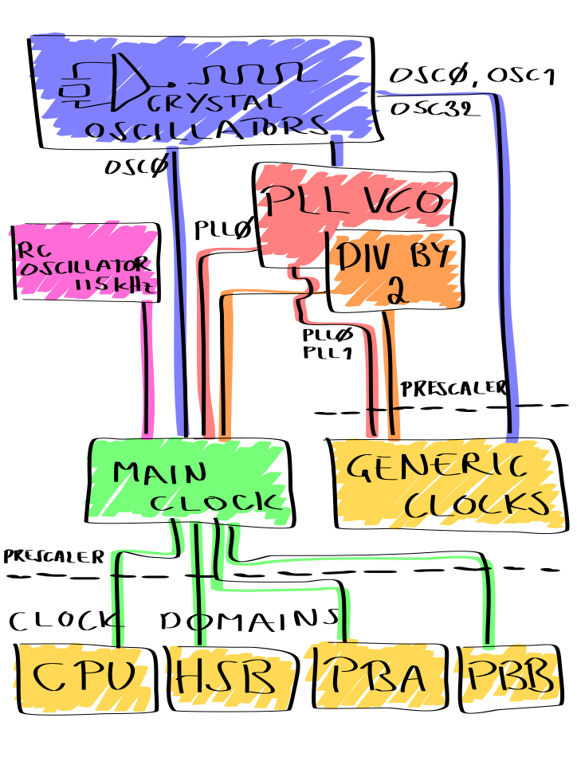

UC3A0/1 system clocks described
===============================

UC3A0/1 chips have quite a complex clock system as it can be seen from the figure. At start-up the UC3 runs at its internal RC oscillator that's 115 kHz. This means that the Main clock has been clocked from this RC oscillator and that the CPU frequency equals to 115 kHz. That's because by default the clock domain prescaler has been disabled. This also means that all the other clock domains, that are HSB, PBA and PBB, runs at 115 kHz frequency as well.

Main clock means the CPU clock
------------------------------

It's important to understand that all the clock domains are derived from the Main (or Master) clock. The main clock can be clocked from couple of other sources in addition to the RC oscillator. It can be clocked from the OSC0 or PLL0. PLL0 clock frequency can equal to its VCO frequency or VCO/2. As the PLL can have a very high clock frequency it's important to set the clock domain prescaler properly, the maximum frequency is 66 MHz. It's also good to know that CPU and HSB domains must equal each other and that the PBA and PBB frequencies have to be smaller than or equal to CPU.

PLLs can be driven only from the external crystal oscillators and its output can be used, in addition to the Main clock, for the Generic clocks. Generic clocks are multi-purpose clocks. You can use those, for example, to clock your external devices by connecting the clock pin of the device to the proper GPIO pin that can act as an output for the Generic clock. The internal USB and ABDAC peripherals get their clock from the Generic clock module too.

Read more about how to operate with these clocks from the Power Manager within the Modules section.
