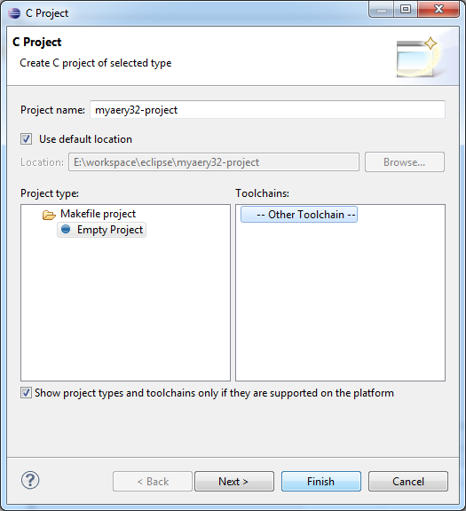
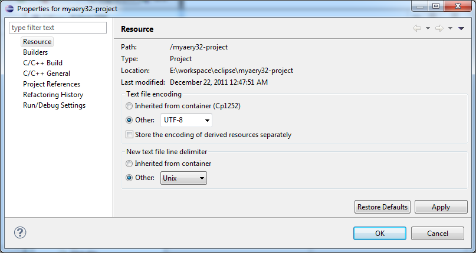
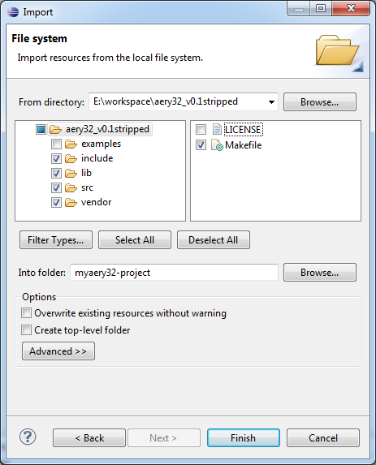
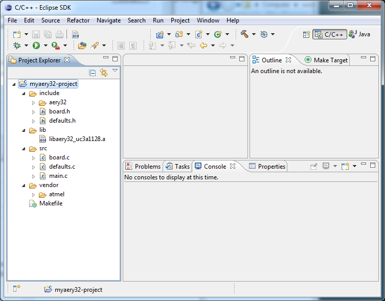
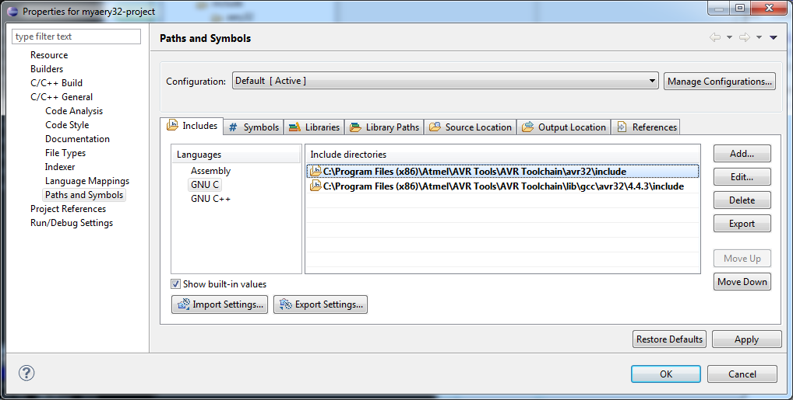
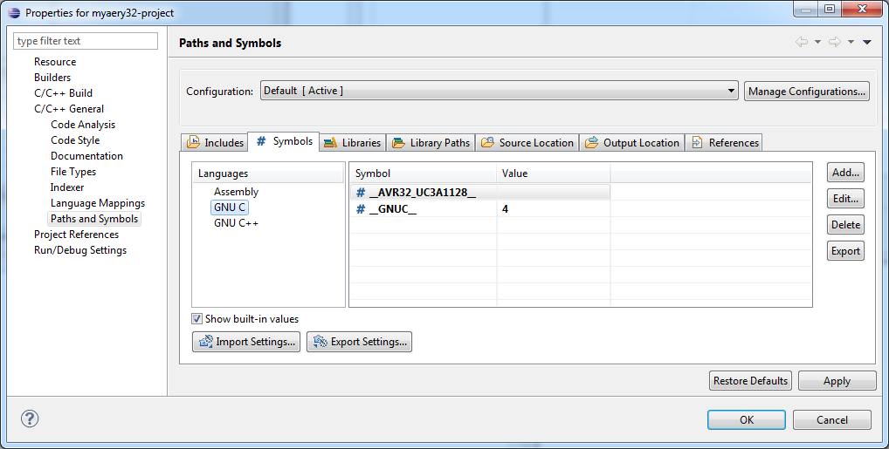
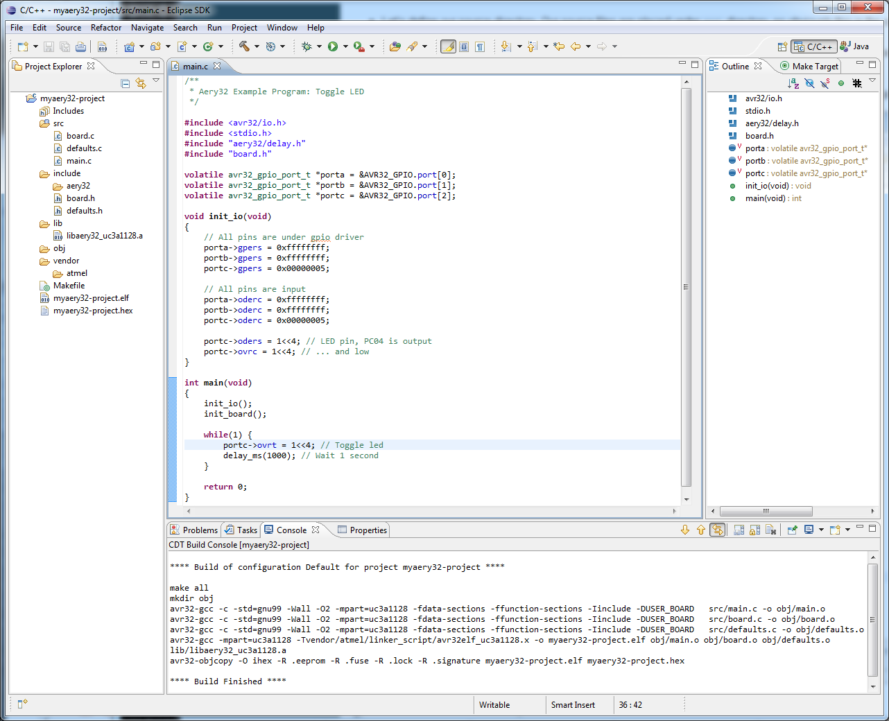
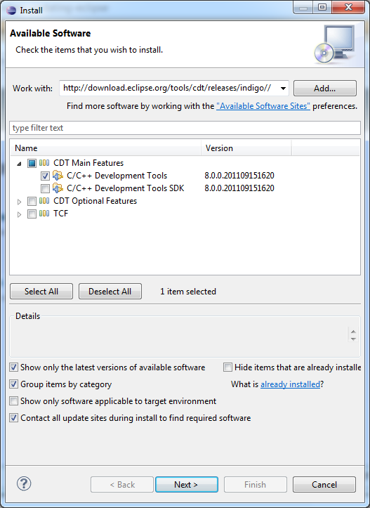
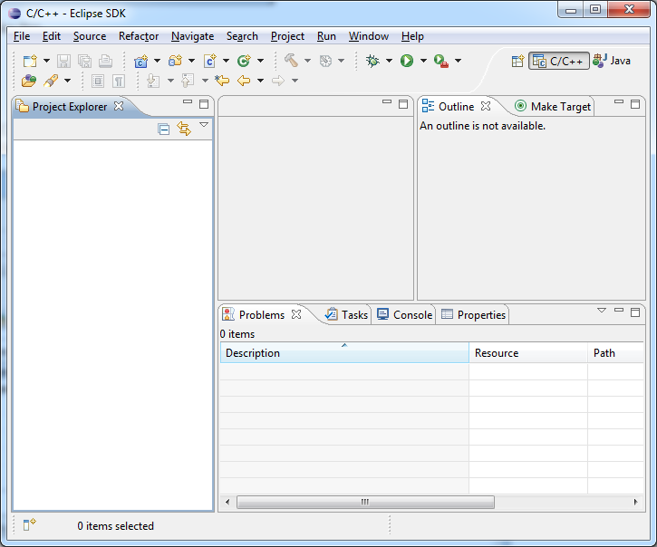

Use Aery32 with...
====

Eclipse CDT
----

.. note:: If you do not have Eclipse installed, see the installation instructions below.

**Step 1: Create a C project**

- To create a new C project select *File - New - C Project*
- Give a name for the project and specify the location where the project files will be placed.
- Aery32 comes with own Makefile so select Makefile project for the project type. Toolchain selection is: *-- Other Toolchain --*.

    Figure 1: Starting a new Aery32-project as a Makefile project

**Step 2: Define project file encoding**

- Right click the created project from the left hand side and select *Properties*
- From *Resources* set text file encoding to UTF-8 and new text file line delimeter to Unix:

    Figure 2: Set file encoding to UTF-8 and line delimiter to Unix

**Step 3: Import Aery32 files into the project**

- Now when the project is started let's import Aery32 files. Right click the created project from the left hand side and select *Import*.
- From the *General* folder select *File System* and press Next.
- Browse to the Aery32 folder and select only essential files and folders as shown below in figure 2.

  - You may like to include ``examples`` if you are not yet familiar with Aery32.

    Figure 3: Importing Aery32 files and folders into myaery32-project

    Figure 4: After successful import the Project Explorer should look like this

**Step 4: Setup Paths and Symbols**

- Again right click the project and select *Properties*
- Select *C/C++ General - Paths and Symbols*

  - Add include directories of AVR32 header files and GCC library. The directories which to include depends where you have installed AVR32 toolchain.
  - Add mpart and gnuc version to symbols list to make Eclipse indexer work correctly

    Figure 5: Add include paths to AVR32 headers and GCC library

    Figure 6: Add symbols to tell Eclipse how to parse AVR32 headers and GCC library

**Step 5: Fine adjust the project**

- Let's define our source directory. Our source files are placed under ``src\`` directory, so obviously this is the one we are looking for. Right click the project and select *New - Source Folder*

  - Browse Folder name and select ``src``. Press OK and then Finish.

- To add make targets select Make Target tab from right hand side. If you do not have this tab in right sidebar, select *Window - Show View - Make Target*.

  - Click the green sight to add new make target.
  - Add these targets: all, clean, re, program, programs, re and start

- Now open main.c and double click *all* make target to compile the example program. After successful compile process the project windows should look like this.

    Figure 7: Aery32 project successfully compiled

Install Eclipse
''''

**In Windows**

- You will need Java Runtime Engine installed, so install this first if not yet installed.

  - Download and install Java Runtime Engine (JRE) from http://www.java.com/en/download/index.jsp

- Download Eclipse Classic from http://www.eclipse.org/downloads/
- Unzip the file in the desired directory, for example ``C:\myprograms``, and you have Eclipse installed in ``C:\myprograms\eclipse``. That's it.
- You may like to create a shortcut to ``eclipse.exe`` executable into your desktop -- or if you have Windows 7 you could right click it and select *Pin To Start Menu*.

**In Linux (Debian 6)**

Open terminal and do::

  sudo aptitude install eclipse-cdt #installs CDT plugin too

Install CDT plugin
^^^^^

**Windows (and Linux if not installed with package manager)**

- Start Eclipse if not yet started.
- Select: *Help - Install New Software...*
- Write ``http://download.eclipse.org/tools/cdt/releases/indigo//`` into *Work with:* field and press Enter.
- Select *C/C++ Development Tools* under *CDT Main Features* as shown in figure 2, press Next and Finish installation.
- After successful installation you have to restart Eclipse. After done that. Close the Welcome screen if shown and let's change perspective from Java to C/C++.

  - Select: *Window - Open Perspective - Other - C/C++*

- Now Eclipse should look like in figure 3. See that C/C++ shows up in the right upper corner.

    Figure 8: Select C/C++ Development Tools to install CDT plugin.

    Figure 9: Eclipse main view with C/C++ perspective enabled. There are no added projects yet.

