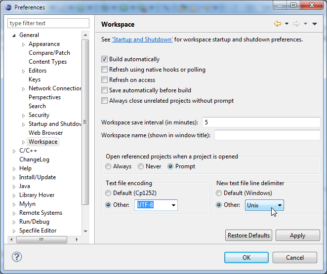
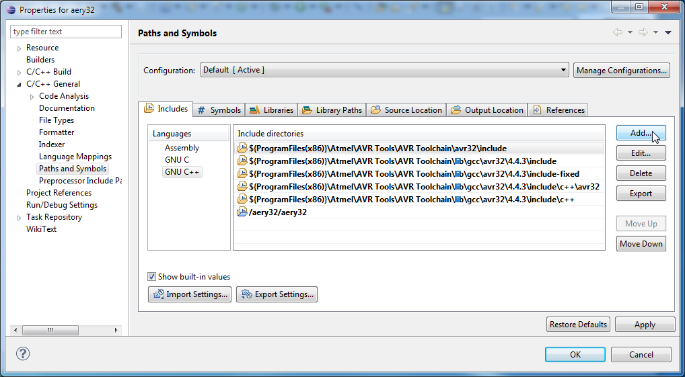
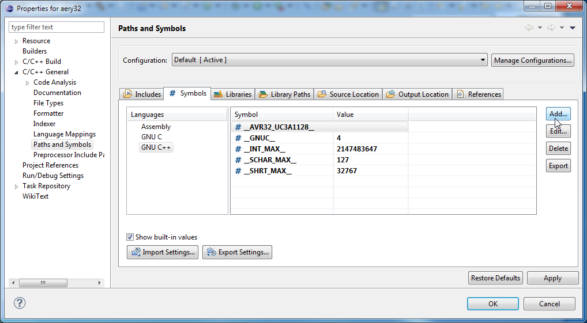
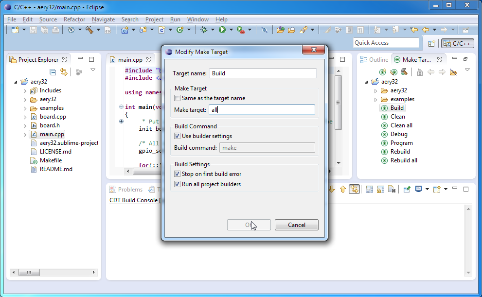

Eclipse Juno
============

Installation
------------

First make sure that you have Java runtime environment (Java JRE) installed. You can `download Java <http://www.java.com/en/download/manual>`_ from Oracle. After then `download Eclipse IDE for C/C++ Developers <http://www.eclipse.org/downloads/>`_ from Eclipse's homepage. Be sure to select the same bit version than your JRE.

To continue browse to the folder where you downloaded Eclipse and unzip the file there. Now you have a folder called ``eclipse``. You can just browse to that folder and double click ``eclipse.exe`` to start Eclipse. However, before doing that you may like to move the ``eclipse`` folder some other place (away from your download directory) and then make a shortcut to ``eclipse.exe``.

That was all about the installation of Eclipse.

First start
'''''''''''

Eclipse stores your projects in a folder called a workspace. You may have several workspaces around your hard disk. Each time you start Eclipse the location of the workspace has been asked. If you like to work in one workspace only, check the box that says **Use this as the default and do not ask again**.

.. image:: ../images/eclipse_juno_select_workspace.png
    :target: _images/eclipse_juno_select_workspace.png
    :alt: Select workspace in Eclipse Juno

When Eclipse has been started, change the perspective from Java to C/C++ by clicking the **Open perspective** icon from the right upper corner. Then select **C/C++** and press OK.

.. image:: ../images/eclipse_juno_open_cdt_perspective.png
    :target: _images/eclipse_juno_open_cdt_perspective.png
    :alt: Open perspective in Eclipse Juno

It is also good idea to use **UTF-8** text file encoding and Unix style new text file line delimiter (Aery32 Framework uses these settings). You can change these preferences globally for the workspace you are working from **Window / Preferences**. From the left side list select **General / Workspace**.

Lastly get rid of the welcome screen by closing it. You can open it again, if you like from **Help / Welcome**

.. image:: ../images/eclipse_juno_close_welcome_screen.png
    :target: _images/eclipse_juno_close_welcome_screen.png
    :alt: Close welcome screen of Eclipse Juno

Import Aery32 Framework as a Makefile project
---------------------------------------------

Aery32 Framework can be imported into Eclipse as a Makefile project. Start by creating a new project **File / New / Makefile Project ...**, or press **Alt-Shift-N**.

.. image:: ../images/eclipse_juno_create_makefile_project.png
    :target: _images/eclipse_juno_create_makefile_project.png
    :alt: Create a new Makefile Project in Eclipse Juno

Browse to the location of Aery32 Framework by using **Browse...** button. Eclipse will name the project according to the directory, but you can change it whatever you like. It is important to choose ``<none>`` for the **Toolchain for Indexer**.

.. image:: ../images/eclipse_juno_import_existing_code.png
    :target: _images/eclipse_juno_import_existing_code.png
    :alt: Import existing code in Eclipse Juno

Now you have a project created and you can open e.g. the ``main.cpp`` from the **Project Explorer**. Right handside you have panels for the source file **Outline** and the project **Make Targets**.

.. image:: ../images/eclipse_juno_makefile_project_created.png
    :target: _images/eclipse_juno_makefile_project_created.png
    :alt: This is how it looks after creating a Makefile project in Eclipse Juno

Setting Paths and Symbols
-------------------------

To get Eclipse indexer working with the AVR32 Toolchain and Aery32 include files, you have to set up paths and symbols. Open **Project / Properties** and then **C/C++ General / Paths and Symbols**. Add the following include paths. When you are adding the aery32 include path be sure to check **Is a workspace path** box too.

Next open **Symbols** tab and add the following symbols.

Setting Makefile targets
------------------------

Makefile targets can be added from the right-hand side panel. Here I have added all targets needed for compiling and programming the board along additional supportive targets. You can run the target by double clicking it.

