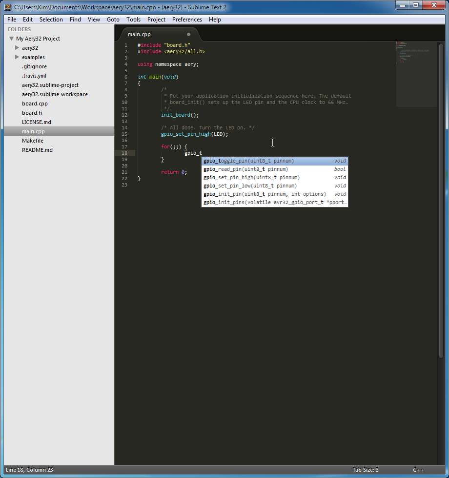

Sublime Text 2
==============

Aery32 Framework comes with the default Sublime Text 2 project file which you can use straight away. The quickest way to start the Aery32 project is to browse to the project directory and open ``aery32.sublime-project`` file using the right click and then select *Open with Sublime Text 2*.

.. image:: ../images/st2_open_project_file.png
    :width: 8 cm
    :target: _images/st2_open_project_file.png
    :alt: Open ST2 project file with right click

After then change the default build system to *Aery32* from *Tools / Build System*.

.. image:: ../images/st2_select_build_system.png
    :width: 8 cm
    :target: _images/st2_select_build_system.png
    :alt: Change ST2 build system to Aery32

Shortcut keys for compile and board programming
-----------------------------------------------

Use **Ctrl+B** and **Ctrl+Shift+B** shortcut keys to compile the project and to program the board, respectively. For other make targets press **Ctrl+Shift+P** and write *build*. Then select the desired target from the list.

Open files quickly
------------------

If you want to open a file, let's say ``aery32/aery32/gpio.h``, press **Ctrl+P** and write *gpio*. Then select the file from the list. Otherwise use the folder tree at the left side. The folder tree can be switched on and off with **Ctrl+K+B** (first press Ctrl+K then keep pressing Ctrl and press B).

Autocompletion with SublimeClang
--------------------------------

SublimeClang provides a neat autocompletion for the Aery32 project. With this plugin you don't have to remember all the functions completely. Just write the beginning of the function, for example, *gpio_t* and the plugin shows you a list of functions.

