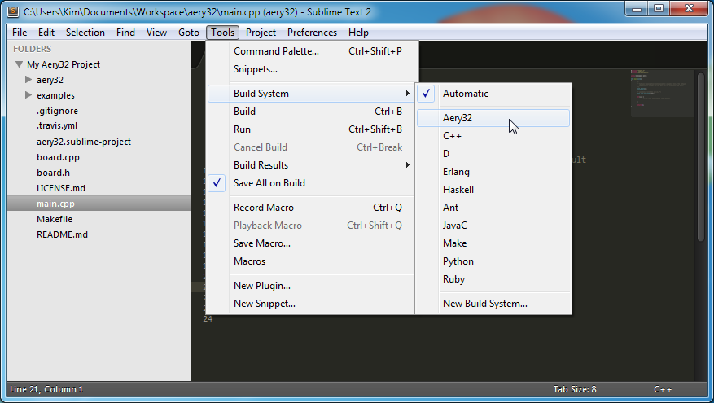

Sublime Text 2
==============

Aery32 Framework comes with the default Sublime Text 2 project file which you can use straight away. The quickest way to start the Aery32 project is to browse to the project directory and open ``aery32.sublime-project`` file using the right click and then select *Open with Sublime Text 2*.

After then change the default build system to *Aery32* from *Tools / Build System*.

Shortcut keys for compile and board programming
-----------------------------------------------

Use **Ctrl+B** and **Ctrl+Shift+B** shortcut keys to compile the project and to program the board, respectively. For other make targets press **Ctrl+Shift+P** and write *build*. Then select the desired target from the list.

Open files quickly
------------------

If you want to open a file, let's say ``aery32/aery32/gpio.h``, press **Ctrl+P** and write *gpio*. Then select the file from the list. Otherwise use the folder tree at the left side. The folder tree can be switched on and off with **Ctrl+K+B** (first press Ctrl+K then keep pressing Ctrl and press B).

Autocompletion with SublimeClang
--------------------------------

`SublimeClang <https://github.com/quarnster/SublimeClang>`_ provides a neat autocompletion for the Aery32 project. With this plugin you don't have to remember all the functions completely. Just write the beginning of the function, for example, *gpio_t* and the plugin shows you a list of functions.

.. image:: ../images/st2_autocompletion.png
    :target: _images/st2_autocompletion.png
    :alt: Example of ST2 autocompletion with SublimeClang

So first install SublimeClang as instructed in its README. Then open ``aery32.sublime-project`` and add the following in settings. If you are on Linux or Mac OS X, alter the AVR Toolchain installation directory appropriately.

.. code-block:: none

	"sublimeclang_enabled": true,
	"sublimeclang_options": [
		"-Wall",
		"-I${this_file_path}/aery32",
		"-IC:/Program Files (x86)/Atmel/AVR Tools/AVR Toolchain/avr32/include",
		"-IC:/Program Files (x86)/Atmel/AVR Tools/AVR Toolchain/lib/gcc/avr32/4.4.3/include",
		"-IC:/Program Files (x86)/Atmel/AVR Tools/AVR Toolchain/lib/gcc/avr32/4.4.3/include-fixed",
		"-IC:/Program Files (x86)/Atmel/AVR Tools/AVR Toolchain/lib/gcc/avr32/4.4.3/include/c++",
		"-IC:/Program Files (x86)/Atmel/AVR Tools/AVR Toolchain/lib/gcc/avr32/4.4.3/include/c++/avr32",
		"-D__AVR32_UC3A1128__",
		"-D__GNUC__=4",
		"-D__SCHAR_MAX__=127",
		"-D__INT_MAX__=2147483647",
		"-D__SHRT_MAX__=32767"
	],
	"sublimeclang_dont_prepend_clang_includes": true,
	"sublimeclang_show_output_panel": false,
	"sublimeclang_show_status": false,
	"sublimeclang_show_visual_error_marks": true

.. image:: ../images/st2_sublimeclang_settings_for_avr32.png
    :target: _images/st2_sublimeclang_settings_for_avr32.png
    :alt: ST2 SublimeClang settings for AVR32 Toolchain