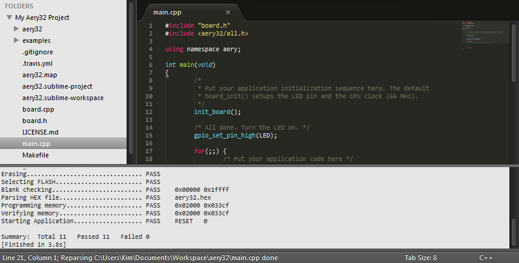
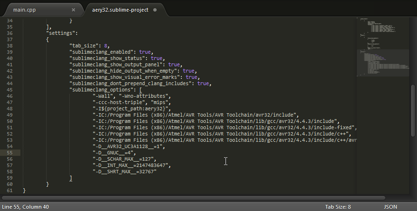

Sublime Text 2
==============

.. note::

	These instructions are written for Windows but should work similarly in Linux and Mac OS X. And don't miss the Aery32 plug-in for Sublime Text 2.

Aery32 Framework comes with the default `Sublime Text 2 <http://www.sublimetext.com/2>`_ project file which you can use straight away. The quickest way to start the project is to browse to the project directory and open ``aery32.sublime-project`` file using the right click and selecting *Open with Sublime Text 2*.

.. image:: ../images/st2_open_project_file.png
    :target: _images/st2_open_project_file.png
    :alt: Open ST2 project file with right click

After then change the default build system to *Aery32* from *Tools/Build System*.

.. image:: ../images/st2_select_build_system.png
    :target: _images/st2_select_build_system.png
    :alt: Change ST2 build system to Aery32

Shortcut keys
-------------

Use **Ctrl+B** and **Ctrl+Shift+B** shortcut keys to compile the project and to program the board, respectively.

For other make targets press **Ctrl+Shift+P** and write *build*. Then select the desired target from the list.

When you want to open a file, let's say ``aery32/aery32/gpio.h``, press **Ctrl+P** and write *gpio*. Then select the file from the list. Of course you can also use the folder tree from the left-hand side if you like. Btw. it can be switched on and off with **Ctrl+K+B**.

Autocomplete with SublimeClang
------------------------------

`SublimeClang <https://github.com/quarnster/SublimeClang>`_ provides a neat autocompletion for Aery32 project. With this plugin you don't have to remember all the function names and their parameters completely. Just write the beginning of the function, for example *gpio_t*, and you get a list of functions. Press **Ctrl+Space** to move on the list and **Tab** to select the function. When you have set the first param, you can press **Tab** again to jump to the next one.

SublimeClang prerequisites for the clang static analyzer is to have clang installed and set in your path. The other functionality works without having the clang binaries installed. Here we only use the "other functionalities" and thus do not need clang. So install SublimeClang as instructed in its README without paying any attention toward clang. In Linux you can also skip the additional prerequisities.

Now open ``aery32.sublime-project`` and add the following settings. If you are on Linux or Mac OS X, alter the AVR Toolchain installation directory appropriately. The preprocessor definitions within the sublimeclang_options, like *-D__AVR32_UC3A1128__=1*, are the few that we have found to be essentials. If you use `Aery32 Sublime Text 2 plug-in <https://github.com/aery32/sublime-aery32>`_ to create a new project, other definitions are added too so the list will be far longer.

.. code-block:: none

	"sublimeclang_enabled": true,
	"sublimeclang_show_status": true,
	"sublimeclang_show_output_panel": true,
	"sublimeclang_hide_output_when_empty": true, 
	"sublimeclang_show_visual_error_marks": true,
	"sublimeclang_dont_prepend_clang_includes": true,
	"sublimeclang_options": [
		"-Wall", "-Wno-attributes", 
		"-ccc-host-triple", "mips", 
		"-I${project_path:aery32}", 
		"-IC:/Program Files (x86)/Atmel/AVR Tools/AVR Toolchain/avr32/include",
		"-IC:/Program Files (x86)/Atmel/AVR Tools/AVR Toolchain/lib/gcc/avr32/4.4.3/include",
		"-IC:/Program Files (x86)/Atmel/AVR Tools/AVR Toolchain/lib/gcc/avr32/4.4.3/include-fixed",
		"-IC:/Program Files (x86)/Atmel/AVR Tools/AVR Toolchain/lib/gcc/avr32/4.4.3/include/c++",
		"-IC:/Program Files (x86)/Atmel/AVR Tools/AVR Toolchain/lib/gcc/avr32/4.4.3/include/c++/avr32",
		"-D__AVR32_UC3A1128__=1",
		"-D__GNUC__=4",
		"-D__SCHAR_MAX__=127",
		"-D__INT_MAX__=2147483647",
		"-D__SHRT_MAX__=32767"
	]

Aery32 plug-in
--------------

With `Aery32 plug-in for Sublime Text 2 <https://github.com/aery32/sublime-aery32>`_ you can easily create new projects. All the above setup process is automated for you. Just install the plugin via the Package Control plug-in (manual install also possible) and start using it as any other ST2 plug-in. See https://github.com/aery32/sublime-aery32#installation.

